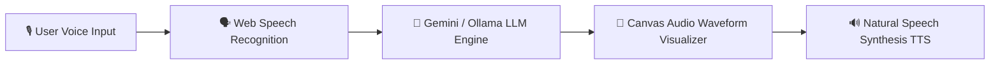

# Vocalis AI 🎙️

<div align="center">
  <h3>Web-Based Conversational Voice Assistant & Audio Visualizer</h3>
  <p><em>Assistant Vocal Web Conversationnel & Visualiseur Audio</em></p>

  <br />
  
  <!-- Demonstration Banner -->
  <div style="border: 1px solid rgba(255,255,255,0.2); border-radius: 12px; padding: 10px; background: rgba(0,0,0,0.5);">
    
    <p><sub>🎬 <b>Demonstration / Aperçu Visuel :</b> Remplacez <code>preview.gif</code> par la vraie démo animée du projet.</sub></p>
  </div>

  <br />
      
</div>

---

<details open>
  <summary><b>📌 Table of Contents / Table des matières</b></summary>
  <ul>
    <li><a href="#-english">🇬🇧 English</a></li>
    <ul>
      <li><a href="#-about-the-project">About the Project</a></li>
      <li><a href="#-architecture--data-flow">Architecture & Data Flow</a></li>
      <li><a href="#-key-features">Key Features</a></li>
      <li><a href="#-getting-started">Getting Started</a></li>
    </ul>
    <li><a href="#-français">🇫🇷 Français</a></li>
    <ul>
      <li><a href="#-à-propos-du-projet">À propos du projet</a></li>
      <li><a href="#-architecture--flux-de-données">Architecture & Flux de données</a></li>
      <li><a href="#-fonctionnalités-clés">Fonctionnalités clés</a></li>
      <li><a href="#-démarrage-rapide">Démarrage rapide</a></li>
    </ul>
    <li><a href="#-license--licence">📜 License / Licence</a></li>
  </ul>
</details>

---

## 🇬🇧 English

### 📖 About the Project
Vocalis AI is a web-based voice assistant orchestrating continuous hands-free Speech Recognition, LLM contextual reasoning (Gemini & Ollama), audio visualizer canvas, and natural Speech Synthesis (TTS).

### 🏗️ Architecture & Data Flow


### ✨ Key Features
- 🎙️ **Hands-Free Speech Recognition**: Continuous web-based speech-to-text engine
- 🧠 **Dual LLM Integration**: Cloud (Gemini API) and local (Ollama) reasoning models
- 🌊 **Audio Waveform Canvas**: Dynamic 60fps audio spectrum visualizer
- 🔊 **Natural Voice TTS**: Fluid multi-voice text-to-speech feedback

### 💻 Getting Started
To install and run this project locally:
```bash
start.bat
```

---

## 🇫🇷 Français

### 📖 À propos du projet
Vocalis AI est un assistant vocal web orchestrant la reconnaissance vocale continue, le raisonnement sémantique d'IA (Gemini & Ollama), un visualiseur d'ondes audio sur Canvas HTML5 et la synthèse vocale naturelle.

### 🏗️ Architecture & Flux de données


### ✨ Fonctionnalités clés
- 🎙️ **Reconnaissance Vocale**: Moteur Speech-to-Text continu en temps réel
- 🧠 **Intégration Double LLM**: Modèles Cloud (Gemini API) et locaux (Ollama)
- 🌊 **Visualiseur Audio Canvas**: Spectre audio réactif à 60 images par seconde
- 🔊 **Synthèse Vocale Naturelle**: Rendu vocal multi-voix fluide (Text-to-Speech)

### 💻 Démarrage rapide
Pour installer et lancer ce projet localement :
```bash
start.bat
```

---

## 📜 License / Licence
Distributed under the MIT License. Copyright © 2026 **Ricardo Ratovoarisoa**. All rights reserved.

---
<div align="center">
  <sub>Built with ❤️ by <b>Ricardo Ratovoarisoa</b> | AI & Full-Stack Developer</sub>
</div>
